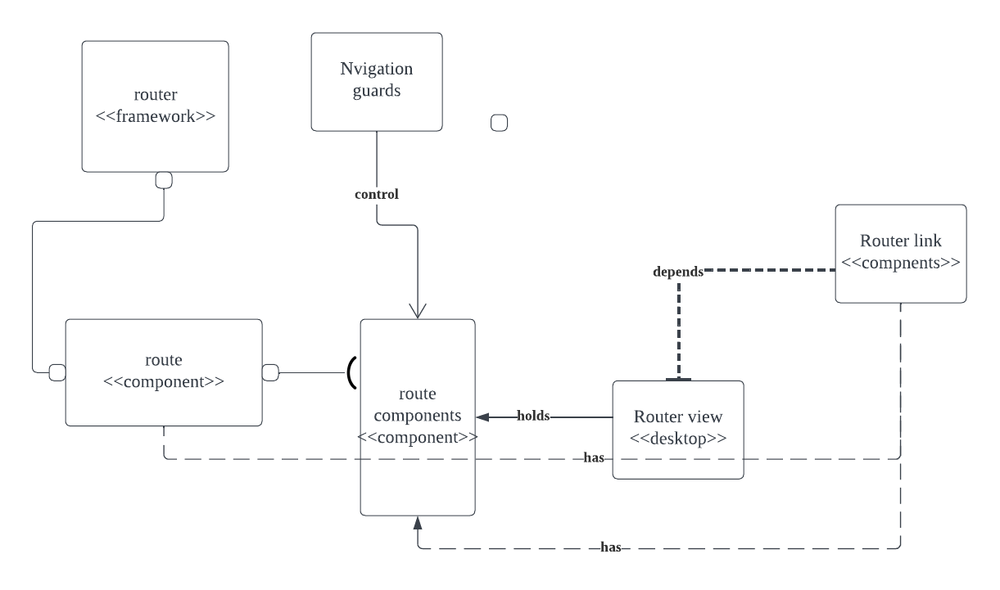

# Vue Router

## Background
Vue CLI( Vue Command Line) is a development tool that aims to simplify and streamline the process of creating, managing, and building Vue.js projects. The Vue.js is a progressive JavaScript framework for building approachable, flexible, and efficient user interfaces. Through a command-line interface, the CLI is a tool that enables developers to communicate with the Vue ecosystem, and provides various commands and features to scaffold new projects, configure project settings, run development servers, and optimize and build projects for production. Vue Router was developed to address the need for a robust routing system within Vue.js applications. It provides a way to map URLs to different views or components, allowing users to create dynamic and responsive Single-Page application. As we doing this project, we mainly focus on the plugins and extensions as it recommends.

## System Components:
### *Figure 1 - Component Image*

`Router`: The component that manages the routing functionality and handles route configuration, navigation, and rendering of route components based on the current URL.\
`Route`: Represents a single route definition in the application. It typically includes properties such as the route path, component to render, and any associated route-specific options.\
`Route Components`: Vue components associated with each route. They represent the views or UI elements that will be rendered when specific routes are active. Examples of route components could include components for the home page, about page, user profile, or any other views in the application.\
`Navigation Guards`: Functions that can be applied to routes and for controling and manipulating the navigation flow. They allow developers to perform actions before entering or leaving a route, such as authentication checks, data loading, or redirections.\
`Router-View`: A special component provided by "vue-router" that acts as a placeholder for the rendered route components. It is typically used in the application's template to define where the active route component should be rendered.\
`Router-Link`: Component provided by "vue-router" that allows for easy navigation between routes. It generates anchor tags with appropriate href attributes based on the specified route paths.

## Introduction
Vue Router is a routing library that allows developers to manage client-side routing in single-page applications (SPAs) built with the Vue.js framework. It enables the creation of dynamic and interactive user interfaces by mapping URLs to specific components. Features include:
  <ul>
    <li>Nested routes mapping</li>
    <li>Dynamic Routing</li>
    <li>Modular, component-based router configuration</li>
    <li>Route params, query, wildcards</li>
    <li>View transition effects powered by Vue.js' transition system</li>
    <li>Fine-grained navigation control</li>
    <li>Links with automatic active CSS classes</li>
    <li>HTML5 history mode or hash mode</li>
    <li>Customizable Scroll Behavior</li>
    <li>Proper encoding for URLs</li>
  </ul>

Vue Router was created by Evan You, the creator of Vue.js, and is currently maintained by the Vue.js team and the open-source community. The Vue.js team is responsible for approving changes to its code and architecture, and the library is developed and maintained as an open-source project.

## Report

### Applied Perspective:
- Client-Server Architecture Perspective:

The client side, which is in charge of the user interface and presentation logic. The two main components of the client-server architecture are the server and data storage, processing, and business logic management. The client and server often utilize HTTP or WebSocket to communicate across a network.

- Relevant Client-Server Architecture Concerns
<ul>

**Scalability** : Consider the system's capacity to scale in order to accommodate growing user traffic and many continuous inquiries. This entails investigating the distributed processing capabilities, caching techniques, and load balancing systems.

**Safety** : Evaluate the system's security procedures in place to guard against unauthorized access, data breaches, and other security risks. Analyzing authentication processes, data encryption, and secure communication protocols may be necessary for this.

**Performance** : Consider the client-server aspect of the vue-router architecture while evaluating performance. To find possible bottlenecks or opportunities for improvement, analyze variables like response times, network latency, and resource use.

**Network Communication** : Consider the client-server interactions and data types used in the vue-router system. This involves investigating any used communication techniques, such as WebSocket connections or RESTful APIs.

**Client-Side Rendering** : Take into account how the vue-router system manages client-side rendering. Analyze the effectiveness of client-side component rendering and how it affects both performance and user experience.

**Data Storage and Management** : Analyze the server-side data storage technologies employed by the system for data management. To guarantee effective data storage and retrieval, examine the data models, database technology, and data management techniques used.
</ul>

### Identify Styles & Patterns Used:

- High-level architectural style:

**Client-side:** Vue Router controls routing logic within the browser rather than on the server. This method enables dynamic changes and smoother transitions between views or pages without requiring a full page reload. Client-side routing allows for a more engaging and responsive user experience.

**Presentation Layer:** This layer is responsible for drawing components and handling user interactions and constitutes the user interface (UI). Vue components serve as the presentation layer in Vue.js apps. Vue Router is embedded into the presentation layer and is in charge of routing and navigation issues. It contains the components and logic required to enable navigating between multiple views based on the active route.

-  Software Design Patterns:

**“Front Controller" design pattern**

The Vue Router uses the "Front Controller" design pattern. The Front Controller design centralizes request handling and serves as a single point of entry for routing and request processing. The router instance functions as the front controller in the context of Vue Router, controlling the routing logic and processing requests for multiple routes.

The Front Controller design is used by Vue Router, which provides a centralized router instance that controls routing setup and handles navigation within a Vue.js application. The router instance defines the accessible routes and associated components, and it handles component rendering based on the active route. Vue Router provides a consistent and centralized method to routing in Vue.js applications, fostering separation of concerns and modularization.
