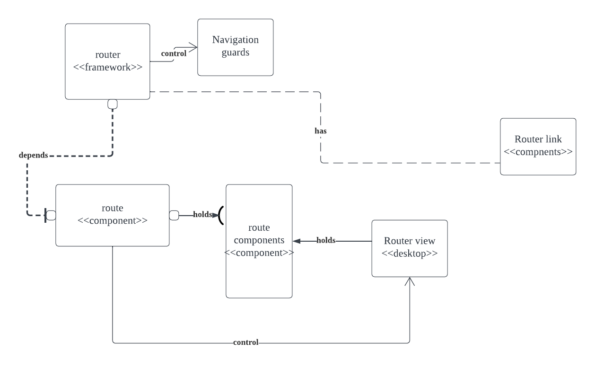

# Vue Router
A robust routing framework created specifically for Vue.js applications is called Vue Router. It has a thorough routing system and effortlessly interacts with Vue.js, a progressive JavaScript framework for creating user interfaces. Developers may quickly associate URLs with various components using Vue Router, allowing dynamic and responsive Single-Page Applications (SPAs). It enables developers to design contemporary web applications with fluid navigation and user experiences by supporting features like nested routes, lazy-loading routes, and parameter passing. Vue Router improves the Vue.js ecosystem and makes it easier to create intricate routing systems for your Vue.js applications, whether you install it manually or use it within the Vue CLI.

## Context and Background
 The Vue.js is a progressive JavaScript framework for building approachable, flexible, and efficient user interfaces. The Vue router is an important component of the Vue.js ecosystem, and the official Github repository for the Vue router serves as a valuable resource for understanding the implementation and architecture of the Vue Router. The repository also has extensive documentation and guidelines, making it an essential developer reference. Vue Router was developed to address the need for a robust routing system within Vue.js applications. It provides a way to map URLs to different views or components, allowing users to create dynamic and responsive Single-Page application. As we doing this project, we mainly focus on the plugins and extensions as it recommends.

## Development View
The development view analyzes the component-level structure of Vue Router, identifying the major modules and their dependencies. The below section offers an overview of the system's components, their organizations, and interactions.
### System Components
The source code needs to be analyzed to understand the component-level architecture of the Vue Router. The source code analysis will also help in understanding the components of the system. Discussed below are the components of the Vue router repository:
1. Router:
The core element for managing the routing functionality, including the route configuration, navigation, and rendering of route components based on the current URL, is the 'Router.'
2. Route:
The 'Route' component represents a single route definition within the application. It includes properties such as the route path, the component to render, and any route-specific options.
3. Navigation Guards:
Vue Router offers a robust mechanism called navigation guards. The guards are functions that can be applied to routes, allowing developers to control and manipulate the navigation flow. Navigation guards enable authentication checks and data validation before entering or leaving a route.
4. Route Components:
Vue Router works with various Vue components associated with each route. These components represent the views or UI elements rendered when specific routes are active. Examples of route components include home pages, about pages, user profiles, or any other views within the application.

### *Figure 1- UML Diagram for Vue Router*

This figure shows how components interact with each other and the dependency within.

### Dependencies
The component-level architecture also includes dependencies within and outside the system. Vue Router relies on the Vue.js framework as a foundational element. Vue Router relies on the Vue.js framework to integrate routing functionality seamlessly into Vue.js applications. It leverages Vue.js's reactive data-binding, component composition, and virtual DOM capabilities to enable dynamic and responsive single-page applications. Vue Router extends Vue.js by providing a routing system that maps URLs to different views or components, facilitating the creation of a smooth and intuitive user experience. In addition to its dependence on the Vue.js framework, Vue Router also has dependencies on external libraries or modules that enhance its functionality. These dependencies include libraries for handling authentication, managing state or providing additional features and utilities. Vue Router can offer a more comprehensive and feature-rich routing solution for Vue.js applications by leveraging these external dependencies.
### Source Code Structure
The source code structure of Vue Router reflects the component organization. Further exploration of the GitHub repository is necessary to gain a more comprehensive understanding of the specific files and their roles. Analyzing the repository's files and directories will unveil the distribution of different components and modules.
### Testing and Configuration Approach
Vue Router emphasizes the importance of automated testing to ensure reliability and stability. It provides a comprehensive testing approach integrated into the codebase. Developers can leverage testing frameworks and tools, such as Jest, to create test suites and ensure the correct behavior of the router's components and functionality. Regarding configuration, Vue Router supports various options to customize and adapt the router to specific project requirements. Developers can configure the router through base URL, route mode (history or hash), and fallback routes.
### Conclusion
This report delves into the component-level architecture of Vue Router, a critical component of Vue.js applications. We have identified key components such as Router, Route, Navigation Guards, and Route Components by analyzing the Vue Router repository. The diagram provides a visual representation of their organization and dependencies. Additionally, we have discussed the source code structure, testing approach, and configuration aspects of the Vue Router. Understanding the component-level architecture of Vue Router is essential for developers to build robust and efficient Vue.js applications. By leveraging Vue Router's power, developers can easily create dynamic and responsive single-page applications.


## Applied Perspective
Client-Server Architecture Perspective:
The client side, which is in charge of the user interface and presentation logic. The two main components of the client-server architecture are the server and data storage, processing, and business logic management. The client and server often utilize HTTP or WebSocket to communicate across a network.

We will take into account the following issues when we examine the system's design from a Client-Server design perspective:

- Scalability: The system's capacity to manage growing user volume and ongoing queries is the subject of this concern. We may examine the distributed processing capabilities, caching strategies, and load-balancing systems used in the overall framework of the vue-router system. It is crucial to determine if the design allows for horizontal scaling, which needs are increased by adding additional servers or adopting cloud-based solutions.

- Safety: A key component of every client-server design is security. It entails safeguarding the system from dangers such as data breaches, illegal access, and other security issues. The authentication procedures, data encryption techniques, secure communication protocols (such as HTTPS), and access control measures are implemented in the vue-router system.

- Performance: In client-server designs, performance is crucial, and it's crucial to assess the system's reaction times, network latency, and resource use. We can find possible obstacles and possibilities for development by examining these aspects. Performance in the vue-router system may be improved by methods including caching, improving network connection, and reducing server-side computation.
- Network Communication: Consider the client-server interactions and data types used in the vue-router system. This involves investigating any used communication techniques, such as WebSocket connections or RESTful APIs.
- Client-Side Rendering: Take into account how the vue-router system manages client-side rendering. Analyze the effectiveness of client-side component rendering and how it affects both performance and user experience.
- Data Storage and Management: Analyze the server-side data storage technologies employed by the system for data management. To guarantee effective data storage and retrieval, examine the data models, database technology, and data management techniques used.

Based on these issues, we can carry out the following tasks to approach the Vue-router system from the Client-Server Architecture perspective:

#### First activity: Scalability Analysis
To establish if the server-side components can accommodate rising user traffic, evaluate their distributed processing capabilities.
Examine the caching strategies used to enhance response times and lighten the server's load.
Analyze how well load-balancing structures do their task of distributing the workload across multiple servers.

#### Second activity: security evaluation
Determine the system's critical resources, such as user login information or private information, and assess the safety precautions used to secure them.
Examine the system's susceptibility to risks like cross-site scripting (XSS) or SQL injection attacks.
Review the encryption and authentication techniques employed to guarantee a safe client-server connection.

#### Third activity: Performance assessment
Examine the client-server network connectivity, including any user of RESTful APIs or WebSocket connections.
To find opportunities for performance improvement, measure response times and network latency.
To ensure that client requests are handled efficiently, check the server's resource use.

Through analyzing, We can discover more regarding how the architecture of the vue-router system supports scalability, safety, and performance in a client-server context by putting these tasks into practice and taking into account the pertinent issues. It is essential to remember that these actions should be customized to the system under analysis's unique implementation needs and specifications.

## Identify Styles & Patterns Used
#### High-level architectural style:
Vue Router follows the Model-View-ViewModel (MVVM) architectural approach, with clear distinctions between the Model, View, and ViewModel roles. These distinctions effectively separate data management, user interface, and data binding problems.

The Model layer in Vue Router is linked to the data points in a Vue component. This is where the application's information and functionality are saved. When this data changes in response to user activities, Vue Router may instantly update what the user sees on their screen. Vue Router offers a unique framework that connects the View to the ViewModel in an easy-to-use manner. This means that whenever the ViewModel changes, the View does as well.  The ViewModel layer, or the link between the Model and the View, is essentially a Vue component. A component in Vue Router performs the function of a ViewModel since it manages and modifies the data displayed on the View. It provides the View with attributes and methods and notifies it when something changes.

The Vue Router is an important feature in Vue.js applications that works in tandem with the ViewModel layer. It improves the MVVM architecture's efficacy by controlling application navigation, allowing for more sophisticated user interfaces with multiple views and navigation pathways. Vue Router refreshes the ViewModel, which then updates the View when the navigation path changes. This enables the user interface to be relatively simple.

Indeed, Vue Router employs several important software design patterns to improve its efficiency and maintainability.

#### Front Controller Pattern:
Vue Router acts as a "Front Controller," a design pattern that centralizes all requests and routing rules. The router instance in Vue Router serves as this controller, managing the routing rules and processing multiple route requests.
- **Context**: Vue Router applies the Front Controller pattern, centralizing all request handling.
- **Problem**: Without a centralized system, handling and processing requests for multiple routes can become scattered, leading to potential inconsistencies and increased complexity.
- **Solution**: The router instance in Vue Router acts as a front controller, controlling all routing rules and processing all route requests. It provides a centralized point of control, thereby reducing complexity and increasing predictability.


#### Facade Pattern:
Vue Router simplifies complex processes like managing browser history or matching routes, presenting a streamlined interface for developers. This design pattern, known as the Facade pattern, abstracts complexity, allowing developers to interact with complicated subsystems through a simplified 'facade,' thus enhancing user experience.
- **Context**: Vue Router uses the Facade pattern to simplify its API for developers.
- **Problem**: Managing browser history, handling route matching, and updating components can be complex. Direct interaction with these subsystems can lead to mistakes and unnecessary complexity.
- **Solution**: Vue Router provides a simple interface for these complex subsystems. It abstracts the underlying complexity, allowing developers to interact with the router's features without understanding all the details of how they work.

#### Singleton Pattern:
Vue Router applies the Singleton pattern to ensure there's only one router instance throughout a Vue.js application. This approach centralizes the management of routing and prevents any inconsistencies or conflicts that could arise from having multiple router instances, promoting consistency in navigation.
- **Context**: Vue Router applies the Singleton pattern to the router instance in a Vue.js application.
- **Problem**: Multiple instances of the router could lead to conflicting states and inconsistencies in the application's navigation.
- **Solution**: Using the Singleton pattern, Vue Router ensures that there is only one instance of the router throughout the application. This prevents potential conflicts and promotes consistency in navigation.

#### Observer Pattern:
The Observer pattern is extensively utilized in Vue Router, which enables it to react promptly to changes in the application's state, especially the URL. This pattern works by having an object (Subject) maintain a list of its dependents (Observers), alerting them automatically of any state changes. This means Vue Router can 'observe' the URL and adjust accordingly whenever it changes, resulting in a reactive and responsive application.
- **Context**: Vue Router uses the Observer pattern to react to changes in the application's state, specifically the URL.
- **Problem**: The system needs to update the rendered components whenever the URL changes. Manual updates can lead to inefficiencies and errors.
- **Solution**: With the Observer pattern, Vue Router can 'observe' the URL and react whenever it changes. The router instance (as the Observer) maintains a list of its dependents (as Subjects), and it is notified automatically of any state changes, allowing the system to respond dynamically to URL changes.


## Architectural Assessment
- Single Responsibility Principle
<p>
Vue Router 3.0 adheres to the SRP by focusing on the responsibility of handling navigation and routing within a Vue.js application. Its primary role is to provide a way to define routes, map them to components, and manage the navigation flow. By limiting its scope to routing and navigation-related tasks, Vue Router promotes separation of concerns and keeps the responsibility of routing separate from other application logic. This enhances the modularity and maintainability of the codebase, as changes in routing requirements can be isolated to the router-related code without affecting other parts of the application. Additionally, Vue Router integrates seamlessly with Vue.js components and supports features like route-based code splitting, lazy-loading, and navigation guards. These features further reinforce the SRP by allowing developers to encapsulate specific functionality within individual components, keeping them focused on their primary responsibilities.
</p>
```
export function guardEvent (e: any) {
  // don't redirect with control keys
  if (e.metaKey || e.altKey || e.ctrlKey || e.shiftKey) return
  // don't redirect when preventDefault called
  if (e.defaultPrevented) return
  // don't redirect on right click
  if (e.button !== undefined && e.button !== 0) return
  // don't redirect if `target="_blank"`
  if (e.currentTarget && e.currentTarget.getAttribute) {
    const target = e.currentTarget.getAttribute('target')
    if (/\b_blank\b/i.test(target)) return
  }
  // this may be a Weex event which doesn't have this method
  if (e.preventDefault) {
    e.preventDefault()
  }
  return true
}
```
In link.js, the guardEvent function is responsible for checking various conditions before allowing the default navigation behavior to occur. It checks for control keys, default prevention, right-clicks, and target="_blank" attributes. This function has a single responsibility related to event guarding, which adheres to the SRP.

Additionally, the RouterView component in view.js and its helper functions have responsibilities related to rendering the appropriate component based on the route and handling props. They are closely related to the purpose of the component, making it cohesively follows the Single Responsibility Principle.

- Open-Closed Principle
<p>
Vue Router 3.0 adheres to the Open-Closed Principle by providing extension points and customizable APIs that allow developers to modify and enhance routing behavior without directly modifying the core implementation.
Vue Router enables developers to build upon its existing capabilities without the need to modify the underlying router code. This approach promotes code extensibility, maintainability, and reduces the risk of introducing regressions when making changes to the routing behavior.
For example, developers can customize route matching rules, introduce additional navigation guards, or create custom route components to handle specific scenarios. These extensions can be implemented through options provided by Vue Router, such as “beforeEach” or “beforeResolve” navigation guards, or by using advanced features like route components with custom logic.
By allowing for such extensions, Vue Router empowers developers to adapt the routing behavior to the specific needs of their application, while keeping the core router implementation intact. This separation between the core implementation and extension points aligns with the principles of the OCP.
</p>

Similarly, some examples can be found in the components of Vue Router.
```
const eventTypes: Array<Function> = [String, Array]
```
The eventTypes array defines the types of events that can be specified as the event prop of the RouterLink component. By including different event types in this array, the component can handle additional events without modifying the existing code. This adheres to the Open-Closed Principle because the code is closed for modification, but it can be extended by adding new event types to the eventTypes array.

In view.js, the name prop in RouterView allows for the extension of its component by specifying a different view component name. This means that new view components can be added and rendered without modifying the existing RouterView component code. The component remains closed for modification while being open for extension through the name prop.

- Liskov Substitution Principle
<p>
Vue Router does not directly enforce the Liskov Substitution Principle because it does not involve inheritance or subclassing as a core part of its design. Instead, it focuses on providing routing functionality through composition and configuration within Vue.js applications. Therefore, the concept of substituting objects of a superclass with objects of its subclasses is not directly applicable to Vue Router.
While Vue Router itself does not enforce the LSP, it is a good practice to consider LSP when designing and implementing components that interact with Vue Router. For example, if a base component uses Vue Router's programmatic navigation methods, such as “router.push()” or “router.replace()”, a subclass component should be able to replace it and continue using these methods without introducing errors or breaking the navigation flow. This ensures that your components remain interchangeable and maintain the expected behavior when used in different contexts.
</p>

In the module of navigation guards, isUpdateNavigation and isLeaveNavigation functions are used to determine whether a navigation event should trigger the corresponding guard. When the behavior of these functions is not consistent with the behavior expected from their parent class useFilteredGuard, the LSP is violated.

```
const component = matched && matched.components[name]
// ...
if (!matched || !component) {
  cache[name] = null
  return h()
}
```
Again, router view assumes that the matched object will contain components with specific names and performs actions based on that assumption. However, substituting the matched object with a different implementation that does not conform to these assumptions would lead to incorrect behavior or errors in the RouterView component.


- Interface Segregation Principle
<p>
In the context of Vue Router 3.0, ISP is highly relevant as it provides a modular and cohesive API that allows clients, such as Vue.js components and views, to selectively use the specific parts they require without being forced to depend on unnecessary functionality.
By adhering to ISP, Vue Router enables developers to separate concerns and keep components decoupled from unnecessary dependencies. Clients can interact with Vue Router through specific APIs like route configuration, programmatic navigation methods, navigation guards, and route parameters. This promotes a clean separation of responsibilities and improves code maintainability.
If a component only needs to define routes and handle basic navigation, it can focus solely on the route configuration aspects of Vue Router without being burdened by other functionalities. This allows the component to remain lightweight and focused on its specific responsibilities.
</p>
The onBeforeRouteUpdate function provides a specific interface for registering a guard to be executed before a route update. It focuses on a single responsibility and provides a clear and concise method for implementing this particular functionality. Clients who want to register a guard for route updates can use this function without being forced to depend on any other unnecessary interfaces.The onBeforeRouteLeave function also adheres to the ISP by providing a specific interface for registering a guard to be executed before leaving a route. It encapsulates the responsibility of handling route leave guards and offers a straightforward method for clients to utilize this functionality independently.

- Dependency Inversion Principle
<p>
Since Vue Router is primarily a low-level module that provides routing functionality to higher-level components and views within a Vue.js application. It is not responsible for managing dependencies or enforcing inversion of control.
Developers can just define their own abstractions or interfaces that represent the routing functionality required by their components. By depending on these abstractions, rather than directly on the Vue Router instance, components become independent of the concrete router implementation. Rather than directly importing and using the Vue Router instance in a component, the component could depend on a custom router interface that provides the necessary routing methods and properties. This allows for easier substitution of different routing implementations or mocks during testing.
</p>
For example, onBeforeRouteUpdate and onBeforeRouteLeave functions in navigation guards directly depend on the implementation of the useFilteredGuard function, which in turn depends on the getCurrentInstance and useRouter functions. This violates the DIP because the high-level functions should not depend on the low-level implementation details.

The RouterLink component violates DIP by directly importing and depending on the implementation of the resolveComponent and inject functions from Vue. Components should depend on abstractions rather than specific implementations.

## System Improvement
Multiple actions may be taken to improve the Vue Router system's performance. The system's reaction times will be improved, network latency will be decreased, and resource use will be optimized. The following suggestions can be taken into account:

- **Caching Strategy:**
Use caching to avoid performing time-consuming calculations and data retrieval. Route components, API answers, and other frequently accessed data can all benefit from caching. The technology can speed up response times and lower server load by caching data.

- **Network Connection Optimization:**
Use methods like HTTP/2, connection pooling, and compression to improve network connections. These improvements can help the system run more productively and minimize latency. Moreover, think about employing Content Delivery Networks (CDNs) to distribute static assets, optimizing speed.

- **Minification and Compression:**
JavaScript, CSS, and other static assets should be minified and compressed to minimize their file sizes. Faster download times and better performance, especially on networks with constrained capacity, are caused by smaller file sizes.

- **Code Splitting:**
Implement code-splitting strategies to ensure that only the JavaScript code required for each route or component is loaded. The first load time can be shortened and additional loads can be postponed until they are needed by breaking the code up into smaller portions. This strategy enhances perceived performance and aids in early rendering optimization.

- **Lazy Loading:**
Implement lazy loading to load route components only when they are required. This method shortens the first bundle and accelerates the loading of the first page. You can use dynamic imports or lazy loading or by leveraging Webpack's code-splitting capabilities.

- **Performance Testing and Optimization:**
Perform performance tests often to locate bottlenecks and potential areas for progress. To gauge and assess the system's performance, utilize tools like Lighthouse, WebPageTest, or Chrome DevTools. Apply improvements including crucial rendering route optimization, resource reduction for render-blocking, and TTFB improvement based on test findings.

- **Server-Side Rendering (SSR):**
Consider using server-side rendering (SSR) for pages that demand quicker page loads or improved search engine optimization (SEO). SSR reduces client-side rendering costs and boosts perceived performance by pre-rendering the Vue components on the server and sending the produced HTML to the client.

- **Progressive Web App (PWA) Features:**
Implement PWA capabilities, such as offline caching and service workers, to enable offline access and stimulate speed on subsequent visits. The application may continue to run even when there is no active network connection thanks to the offline functionality provided by service workers, who can also cache static assets and API answers.

- **Database and Data Storage Optimization:**
To guarantee effective data retrieval and manipulation, optimize database queries and data storage. To reduce the time it takes to access data, use effective indexing techniques, denormalization methods, and database speed optimization.

- **Performance Monitoring:**
Implement performance analytics and monitoring to track and evaluate the system's performance over time. To spot performance decline and take proactive measures to solve any problems, use tools like Google Analytics, New Relic, or bespoke monitoring solutions.

The Vue Router system may give quicker response times, enhanced user experiences, and effective resource use by putting these performance improvements into place, which will make the application more performant and responsive.


**Feature improvement:**
In the original code, when a developer makes a mistake by calling certain methods in the wrong place, the error message they see might be confusing. In the updated version, we made the error message more helpful. It now tells the developer that they might be using those methods outside of a Vue component, which is not allowed. This should make it easier for them to understand their mistake and how to fix it.

```
function throwNoCurrentInstance (method) {
  if (!getCurrentInstance()) {
    throw new Error(
      ("[vue-router]: Missing current instance. " + method + "() must be called inside <script setup> or setup(). " +
      "Check that you are within a Vue component context when calling " + method + "().")
    )
  }
}
```
This error message now provides a little more context to the developer as to what might be the problem and what they should look into. Error messages should guide developers to the right solution and not leave them more confused.

**Additional test cases**
1. Test Case: Calling useRouter Outside of a Vue Instance
This case tests the error handling if a developer mistakenly calls useRouter outside a Vue instance.
```
test('calling useRouter outside a Vue instance', () => {
  expect(() => useRouter()).toThrow(
    '[vue-router]: Missing current instance. useRouter() must be called inside <script setup> or setup().'
  );
});
```
2. Test Case: Transition to a Route with Guard
The code uses a guard mechanism for the onBeforeRouteUpdate and onBeforeRouteLeave methods. We need a test that verifies the guard is working correctly and preventing unwanted route transitions.

```
test('onBeforeRouteUpdate guard', () => {
  const mockGuard = jest.fn();
  const mockFn = jest.fn();

  useRouter = jest.fn(() => ({
    beforeEach: (fn) => mockFn
  }));

  const removeGuard = onBeforeRouteUpdate(mockGuard);

  expect(mockGuard).toHaveBeenCalledTimes(1);
  expect(removeGuard).toEqual(mockFn);
});
```
3. Test Case: Active Route
Test the isActive and isExactActive computations in the useLink function. It should accurately reflect the active state of the route.

```
test('useLink isActive & isExactActive', () => {
 useRouter = jest.fn(() => ({
   resolve: jest.fn(() => ({ route: { matched: [{}] }}))
 }));

 useRoute = jest.fn(() => ({
   matched: [{}],
   params: {}
 }));

 const { isActive, isExactActive } = useLink({ to: '/test' });

 expect(isActive.value).toBe(true);
 expect(isExactActive.value).toBe(true);
});
```
**Bug Fix**:
Missing NavigationFailureType and isNavigationFailure in Types

**Issue Description**:
The bug involved missing type definitions for NavigationFailureType and isNavigationFailure in the types exported from the router module of vue-router. This omission caused a lack of type support and documentation for these important components, which could lead to confusion and potential errors for developers using the library.

**Resolution**:
To fix this bug, the missing type definitions were added to the router module. The following changes were made to the code:

```
import { VueRouter, RouterLink, RouterView, START_LOCATION } from './router'

export default VueRouter
export { RouterView, RouterLink, START_LOCATION }
```

After the fix:
```
import { VueRouter, RouterLink, RouterView, START_LOCATION, NavigationFailureType, isNavigationFailure } from './router'

export default VueRouter
export { RouterView, RouterLink, START_LOCATION }
export { RouterView, RouterLink, START_LOCATION, NavigationFailureType, isNavigationFailure }
```
**Explanation**:
The original code was missing the exports for NavigationFailureType and isNavigationFailure. To fix this, the import statement was updated to include these two components from the router module. Additionally, the export statement was modified to include these components in exported types.
With this bug fix, developers using vue-router can now benefit from the proper type support and documentation for NavigationFailureType and isNavigationFailure.
